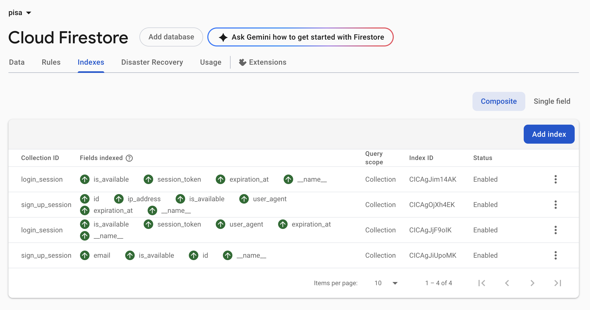

# Installation and Running Guide

## Local Setup

1. **Clone the repository**
    ```bash
    git clone https://github.com/anuwat365/pisa-service.git
    cd pisa-service
    ```

2. **Install dependencies**
    ```bash
    npm install
    ```

3. **Set up Firestore index**
    - Follow the reference image below to configure the required index in Firebase Firestore:
    

4. **Configure environment variables**
    - Duplicate `.env.example` as `.env` and update the values accordingly.

5. **Start the service locally**
    ```bash
    npm run dev
    ```

## Additional Notes

- Make sure all necessary environment variables are configured.
- Check logs for troubleshooting information.